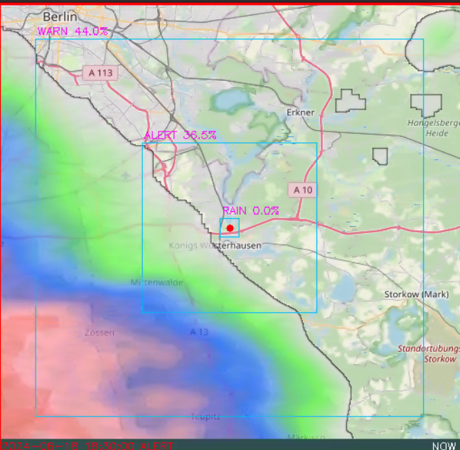
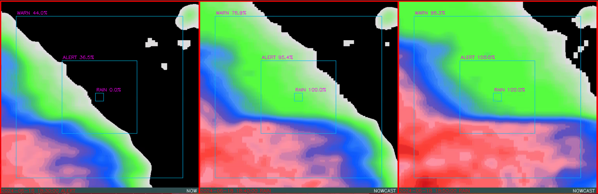

# weather_alert
 Weather alert package is based on Rainwiever API. [https://www.rainviewer.com/api.html](https://www.rainviewer.com/api.html)

 Monitors rain based on radar data from API and publishes ROS messages with 60 minute history and 30 minute forecast every 10 minutes. It can help the robot to hide from the rain in time. Or don't go out at all when it's raining or there's a high probability that it will.

 You can run it standalone or as ROS node and use it for rain forecast on your robot. It's made for VITULUS robot, but can be run on other robots too.

 For map support clone [docker-mapproxy](https://github.com/lacina-dev/docker-mapproxy) and run docker container.

 Follow the comments in the config/config.yaml and adjust lat, lon, etc. for your needs.

 ### Standalone
 Run `python3 scripts/main.py` and then you can check if you are getting what you need. It shows you the current situation in pictures to make sure the configuration is correct.

 *Current rain situation with map and detection frames on the position you configured.*
 

 *Current rain situation and forecast.*
 

 ### ROS (Noetic tested)
 Compile this package in your catkin workspace and run
 `roslaunch weather_alert weather_alert.launch`

 Publications:
  * log_info *[std_msgs/String]*

    Short text if rain alert e.g. Rain now 100%. Published when new forecast received.

  * /weather_alert/rain_alert *[weather_alert/RainAlert]*

    Rain data in ten minute step. Now, 60 minutes to past and 30 minutes forecast. See the message.
